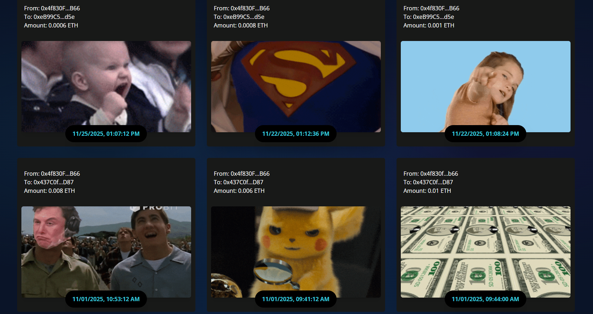
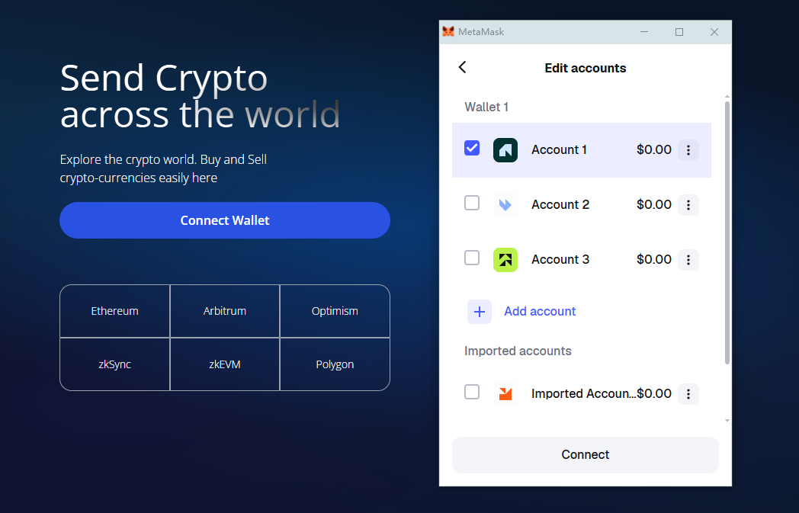
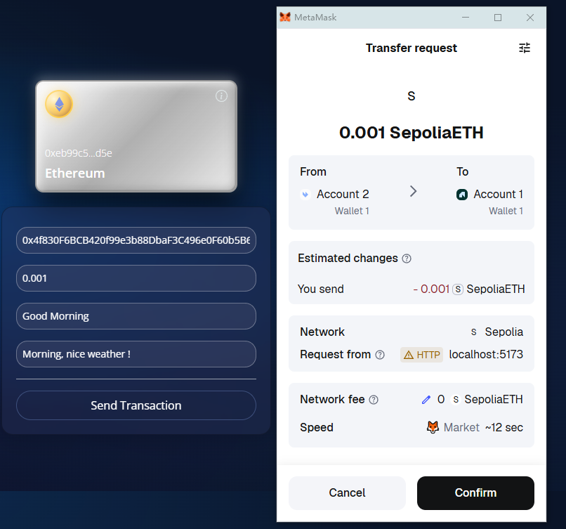
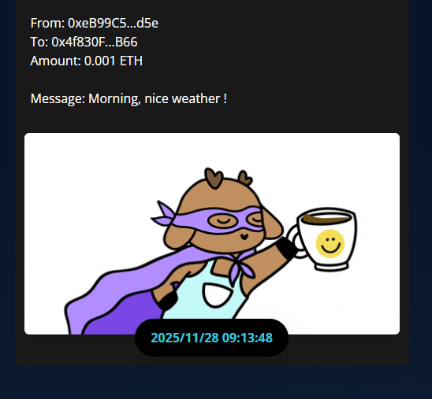
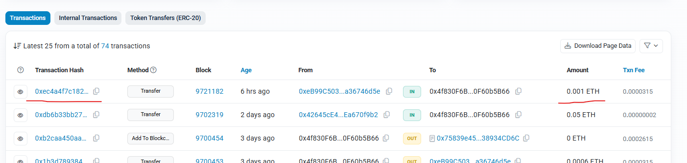

# ETH Transfer DApp - A Unique Blockchain Transaction Experience

## Overview

This innovative decentralized application revolutionizes the way users send Ethereum transactions by pairing each transfer with a randomly generated GIF animation. What makes this truly special? Every transaction, along with its accompanying GIF, is permanently stored on the blockchain, creating an immersive and memorable crypto transfer experience. You can verify any transaction directly on blockchain explorers, ensuring complete transparency and immutability.

## Connecting Your Wallet

Getting started is seamless and intuitive. When you click the **Connect Wallet** button, MetaMask instantly responds, presenting you with your available accounts. This user-friendly interaction allows you to select which wallet address you'd like to use for your transactions.

## Making Your First Transaction

Once successfully connected, the interface transforms to reflect your active session. The Connect Wallet button elegantly disappears, and the Ethereum card on the right side displays your connected wallet's public key address - a visual confirmation that you're ready to transact.

Now comes the exciting part! Fill in the transaction details:

-   **Recipient Address**: Enter the Ethereum address of the person receiving your ETH
-   **Amount**: Specify how much ETH you want to send
-   **Keyword**: Input a keyword that will be used to randomly generate a unique GIF animation for this transaction
-   **Message**: Add a personal message to accompany your transfer

When you click the **Send Transaction** button, MetaMask springs into action, prompting you to review and confirm the transaction details before it's broadcast to the network.

## Transaction Confirmation & Records

After clicking **Confirm**, you'll see comprehensive transaction information including:

-   The smart contract address deployed on the Sepolia testnet
-   Gas fee settings and estimates
-   All relevant transaction parameters

Once the transaction is confirmed on the blockchain, the magic happens - your transaction appears in the "Latest Transactions" section below, beautifully paired with its unique, randomly generated GIF animation. This creates a visual timeline of blockchain activity that's both functional and entertaining.

By simply clicking this GIF, you will be redirected to Sepolia Etherscan and find the transaction, thus verifying its authenticity.

## The Beauty of Blockchain Permanence

Every transaction you make through this DApp is etched into blockchain history forever. The combination of functional crypto transfers with creative GIF pairings transforms routine transactions into memorable moments, all while maintaining the security, transparency, and immutability that blockchain technology promises.

---

## Technical Implementation

### Frontend Development

The user interface is built with modern web technologies to provide a smooth and responsive experience. We use **React** with **Vite** as the build tool for lightning-fast development, and **TailwindCSS** for sleek, customizable styling. The deep blue gradient background creates an immersive crypto-native aesthetic, while the component-based architecture ensures maintainability and scalability.

The frontend handles wallet connections through **MetaMask**, manages transaction states, and fetches data from the blockchain in real-time. All components are carefully designed to provide clear feedback during every step of the transaction process.

**[📄 View Frontend Design Documentation →](client/frontend_design.md)**

### Smart Contract Deployment

At the heart of this application is a Solidity smart contract deployed on the Ethereum **Sepolia testnet**. The contract stores transaction metadata including sender, receiver, amount, message, keyword, and timestamp. We use **Hardhat** as our development environment, which provides robust tools for compiling, testing, and deploying smart contracts.

The deployment process involves setting up environment variables for security, configuring the Hardhat network settings, and running deployment scripts that publish the contract to the blockchain. Once deployed, the contract address becomes the permanent gateway for all transaction recording.

**[📄 View Smart Contract Development Guide →](contract/smart_contract_development.md)**

### Frontend-Contract Integration

The magic happens when the frontend connects with the smart contract. Using **ethers.js v6**, the application creates a bridge between your browser and the Ethereum blockchain. When you submit a transaction, two things happen: first, actual ETH is transferred through MetaMask; second, the transaction details are recorded to our smart contract for permanent storage.

The **TransactionContext** provider manages all blockchain interactions, handling wallet connections, transaction submissions, and data fetching. This centralized state management ensures consistent data flow throughout the application and provides a seamless user experience.

**[📄 View Integration Design Documentation →](Integration/frontend-contract_Integration_design.md)**

---

**Built with**: React, Ethereum, Solidity, Hardhat, MetaMask Integration  
**Network**: Sepolia Testnet  
**Features**: Web3 Wallet Connection, Smart Contract Interaction, GIF API Integration, Transaction History
