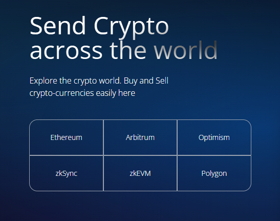
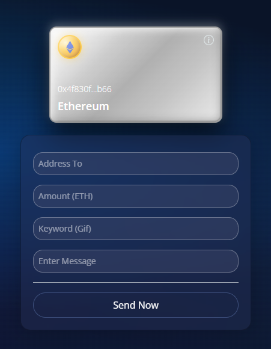
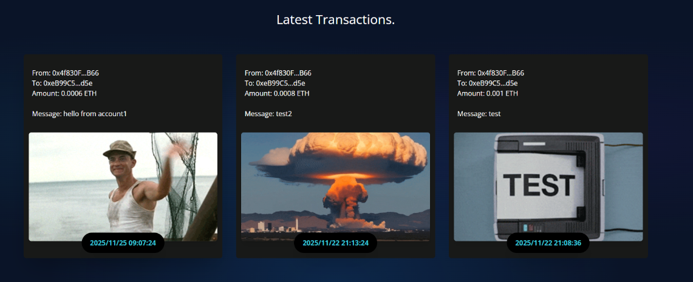
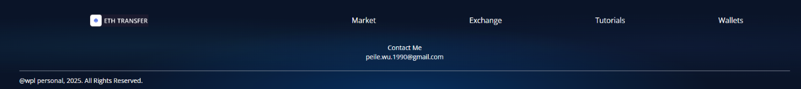
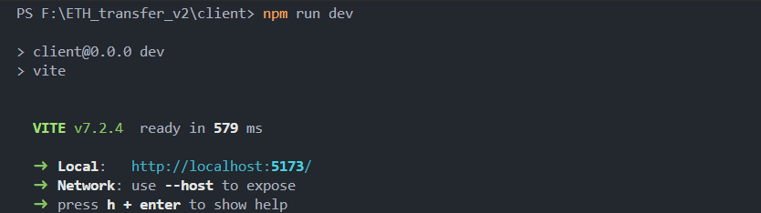

# ETH Transfer - Frontend Documentation

**Author:** Peile Wu  
**Contact:** peile.wu.1990@gmail.com  
**Date:** November 25, 2025

---

## Overview

The `client/` directory contains the frontend application for the ETH Transfer platform. This project uses **Vite** as the build tool and **Tailwind CSS** for styling, providing a modern and efficient development experience.

---

## Technology Stack

### Vite

A modern frontend build tool offering significant advantages over Create React App:

- **Faster builds** - Uses ES modules for instant compilation, making development significantly quicker
- **Better DX** - Lightning-fast hot module replacement for a superior development experience
- **Flexible configuration** - Easier to customize compared to Create React App
- **Lightweight** - More efficient overall

Vite is both lighter and more efficient than traditional build tools.

[Learn more →](https://vite.dev/guide/)

### Tailwind CSS

A utility-first CSS framework that provides atomic classes for rapid UI development:

- **No pre-built components** - Provides large amounts of atomic CSS class names instead of predefined components
- **Rapid development** - Combine utility classes directly in HTML to quickly build interface styles without writing traditional CSS
- **High customization** - Styles are highly customizable and flexible
- **Optimized bundle** - File size is controllable and only includes used styles

[Installation Guide →](https://tailwindcss.com/docs/installation/using-vite)

### Dependencies

```bash
npm install react-icons ethers@6.15.0
```

---

## Design System

The entire page features a **deep blue background** with multiple gradient layers. All related styling configurations are located in `client/src/index.css`.

Background styling includes:

- Deep blue base color (#0a1428)
- Radial gradients creating depth and visual interest

---

## Components

### Navbar

**Location:** `client/src/components/Navbar.jsx`

The top navigation bar containing:

- Logo
- Menu links: Market, Exchange, Tutorials, Wallets
- Login button

**Status:** Layout is complete. All functionality remains to be implemented.

---

### Welcome

**Location:** `client/src/components/Welcome.jsx`

The hero section showcasing the main value proposition and platform features.

**Left Side - Cross-chain Mechanism:**


The cross-chain mechanism is not implemented as it is quite complex and outside the scope of this project. It serves as a placeholder for future direction.

**Right Side - Ethereum Card:**


A silver card displaying Ethereum information. When a wallet is connected, this card will display the connected wallet's account address.

The Welcome section also displays:

- Main headline: "Send Crypto across the World"
- Platform features and value propositions
- Transaction form for users to initiate transfers

---

### Services

**Location:** `client/src/components/Services.jsx`

The service introduction module that highlights the platform's core advantages:

- **Security Guaranteed** - Advanced encryption and multi-signature protocols protect your assets. Our platform undergoes regular security audits to ensure your funds remain safe at all times.

- **Best Exchange Rates** - Real-time market data and optimized algorithms ensure you always get competitive rates. We minimize slippage and provide transparent pricing with zero hidden fees.

- **Fastest Transactions** - Experience lightning-fast transaction speeds powered by optimized smart contracts. Our infrastructure ensures rapid settlement while maintaining network security and reliability.

**Status:** Currently displays text descriptions of services. Specific service content implementation is pending.

---

### Transactions

**Location:** `client/src/components/Transactions.jsx`

The transaction history display section showing recent transactions in card format.



Each transaction card displays:

- Sender address
- Receiver address
- Transaction amount
- Associated message
- GIF animation related to the transaction

**Current Data:** The platform currently displays 3 real transactions:

- All transactions are actual Sepolia ETH transfers
- Between real MetaMask wallet addresses
- GIF images are randomly selected from Giphy based on the transaction message

---

### Loader

**Location:** `client/src/components/Loader.jsx`

An animated loading component that displays during transaction processing. When a user clicks to send a transaction, a silver-white rotating circle appears to indicate that the transaction is being confirmed on the blockchain.

---

### Footer

**Location:** `client/src/components/Footer.jsx`

The footer section containing:

- Navigation links (to be implemented)
- Contact information: peile.wu.1990@gmail.com
- Copyright statement: @wpl personal, 2025. All Rights Reserved



---

## Running the Application

1. Navigate to the client directory:

```bash
cd client
```

2. Start the development server:

```bash
npm run dev
```

3. The terminal will display an HTTP link. Click on it (or Ctrl+Click) to open the application in your browser.


