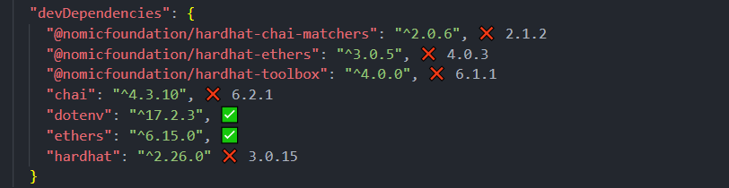
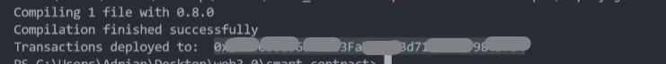

# ETH Transfer Contract - Smart Contract Development Guide

## Prerequisites: Environment Setup

Before writing the contract, selecting the appropriate packages and versions is crucial for ensuring successful compilation and testing. A compatible environment setup significantly reduces development errors.

### Recommended Configuration



The following packages and versions are recommended for this project:

```bash
npm install @nomicfoundation/hardhat-chai-matchers@2.1.2 \
  @nomicfoundation/hardhat-ethers@4.0.3 \
  @nomicfoundation/hardhat-toolbox@6.1.1 \
  chai@6.2.1 \
  dotenv@17.2.3 \
  ethers@6.15.0 \
  hardhat@3.0.15
```

These dependencies provide:

-   **Hardhat**: Development environment for Ethereum smart contracts
-   **Ethers.js v6**: JavaScript library for blockchain interactions
-   **Chai**: Testing framework for assertions
-   **Dotenv**: Environment variable management for sensitive credentials

## Project Setup Steps

### 1. Initialize Hardhat Project

```bash
npx hardhat
```

This creates the basic Hardhat project structure with configuration files and directories.

### 2. Create the Smart Contract

**File: `contracts/Transactions.sol`**

The `Transactions` contract is designed to record and store Ethereum transfer transactions with additional metadata on the blockchain.

#### Contract Components:

**State Variables:**

-   `transactionCount`: Tracks the total number of transactions recorded
-   `transactions`: A dynamic array storing all transfer records

**Data Structure:**

```solidity
struct TransferStruct {
    address sender;           // Address initiating the transfer
    address receiver;         // Address receiving the funds
    uint256 amount;          // Amount transferred in wei
    string message;          // Custom message from sender
    uint256 timestamp;       // Block timestamp of transaction
    string keyword;          // Keyword/tag for categorization
}
```

**Events:**

-   `Transfer`: Emitted whenever a new transaction is recorded, allowing external applications to listen for transaction updates

**Key Functions:**

1. **`addToBlockchain()`** - Records a new transaction

    - Parameters: receiver address, amount, message, and keyword
    - Increments transaction counter
    - Stores transaction details in the blockchain
    - Emits Transfer event

2. **`getAllTransactions()`** - Retrieves all recorded transactions (read-only, no gas cost)

3. **`getTransactionCount()`** - Returns the total number of transactions recorded

### 3. Create Deployment Script

**File: `scripts/deploy.js`**

The deployment script automates the process of deploying the smart contract to a blockchain network.

#### Script Breakdown:

-   **Contract Factory**: `hre.ethers.getContractFactory("Transactions")` creates a factory object representing the contract
-   **Deployment**: `Transactions.deploy()` deploys a new instance of the contract to the network
-   **Confirmation**: `waitForDeployment()` waits for the transaction to be mined and confirmed
-   **Address Output**: `transactions.target` retrieves the deployed contract's address (note: ethers.js v6 uses `target` instead of `address`)

## Deployment to Sepolia Testnet

### Prerequisites

1. **MetaMask Wallet**: Set up a MetaMask wallet with Sepolia testnet ETH

    - Add Sepolia testnet to MetaMask
    - Request test ETH from [Sepolia Faucet](https://sepoliafaucet.com/)

2. **Alchemy API Key**: Create a free account at [Alchemy](https://www.alchemy.com/) and generate an API key for Sepolia network

3. **Environment Variables**: Create a `.env` file in the project root (do not commit this file)

```
SEPOLIA_URL=https://eth-sepolia.g.alchemy.com/v2/YOUR_ALCHEMY_API_KEY
PRIVATE_KEY=YOUR_METAMASK_PRIVATE_KEY
```

**Security Warning**: Never share or commit your `.env` file. Add it to `.gitignore` immediately.

### Configuration

**File: `hardhat.config.js`**

Update your Hardhat configuration to support Sepolia network:

```javascript
require("@nomicfoundation/hardhat-toolbox");
require("dotenv").config();

module.exports = {
    solidity: "0.8.28",
    networks: {
        sepolia: {
            url: process.env.SEPOLIA_URL,
            accounts: [process.env.PRIVATE_KEY],
        },
    },
};
```

### Deploy the Contract

Execute the deployment script targeting the Sepolia testnet:

```bash
npx hardhat run scripts/deploy.js --network sepolia
```

#### Expected Output:



The console will display:

```
Transactions deployed to: 0x[contract_address]
```

Save this contract address—you'll need it to interact with your deployed contract through frontend applications.
